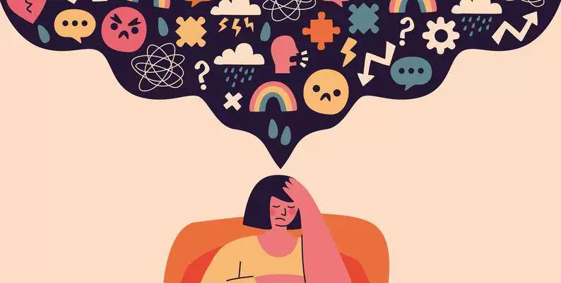
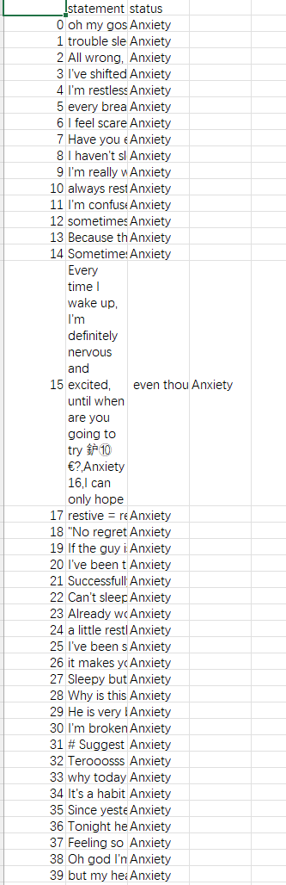

## Body

The comprehensive dataset is meticulously curated by professionals, encompassing information on mental health conditions extracted from various statements. This dataset integrates raw data from multiple sources and undergoes cleaning and organization to become a powerful tool for developing chatbots and conducting sentiment analysis.

The dataset includes annotated statements categorized into seven mental health statuses:
Normal; normal condition
Depression
Suicidal; attempted suicide
Anxiety
Dysthymia
Personality disorder

Data Content
Unique Identifier: A unique identifier for each entry.
Statement Content: Information or posts presented in textual form.
Mental Health Status: The mental health status labeled for the statement. Usage:

This dataset is highly suitable for training machine learning models aimed at understanding and predicting mental health conditions based on textual data.

Electronic virtual products sold are not returnable.

## Images

Here is a pay link on Stripe ( https://buy.stripe.com/3cs8yP7sY87d0vu9AB ). Please contact me lonlonago@foxmail.com after funding $89, and I will send you a complete data files , thank you!

